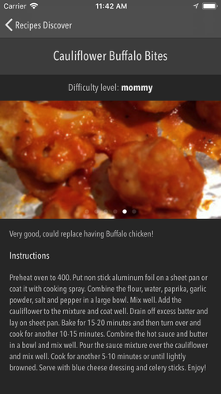

# Recipes-Discover
Two screens test project with JSON download and parsing, images download and caching

## App goal

The application was created to demonstrate the level of knowledge and experience of developing ios applications to the request of a potential customer.

The technical task consisted of two screens (view controllers).

The first screen should contain a table with a list of recipes, including images, a title and a brief description.

It should be possible to search and sort by some fields.

The second screen contains a detailed description of the recipe (recipe complexity, instructions, etc.) and a control for viewing additional images with the possibility of a pagination scrolling.

Recipes are downloaded from the source provided by the customer.

## Features

* Downloads and parses recipes JSON data from web url
* Stores a local recipes cache in the Realm database
* Searches recipes by title, description and instructions
* Sorts by title and last update date
* Recipe details screen allows to view additional images with pagination scrolling
* Has custom UIImageView, with async download image, caching and placeholder with activity indicator

## Dependencies

* [Realm Swift v.3.1.1](https://github.com/realm/realm-cocoa)

## Requirements

* iOS 9.3+
* Swift 4

## Credits

* Created and designed by [**@gussent**](https://github.com/gussent), 2018.

